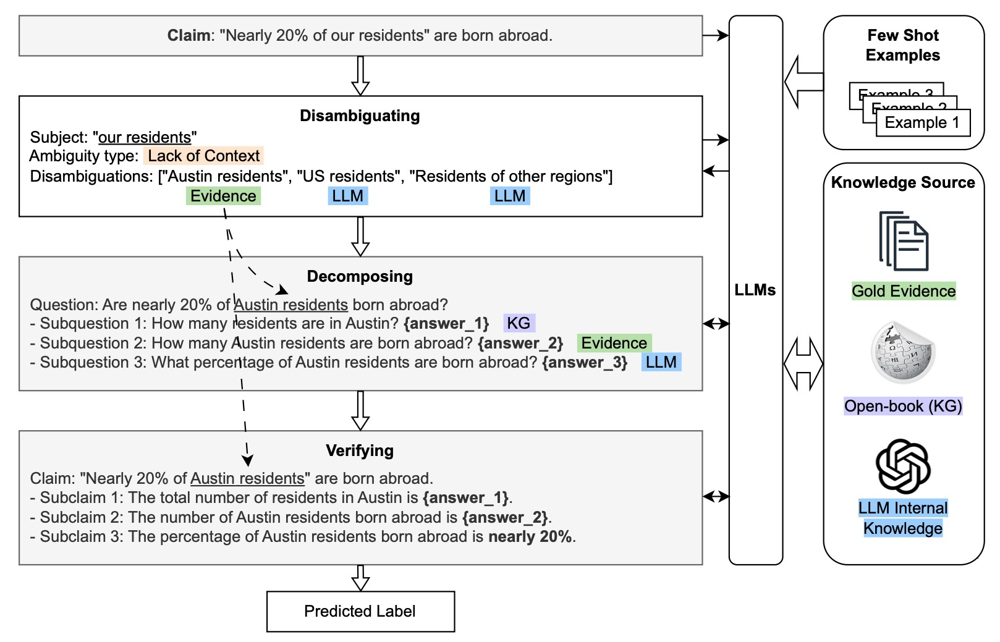

[](https://creativecommons.org/licenses/by-nc-sa/4.0/)

# Disambiguation and Decomposition Fact-checking (D2F) framework.

## About



The proliferation of misinformation underscores the need for robust automated fact-checking systems. While state-of-the-art methods achieve reasonable accuracy in claim verification, they face challenges such as ambiguity in claims and insufficient contextual understanding. This study introduces a Disambiguation and Decomposition Fact-Checking (D2F) framework, a question-driven approach to enhance the reliability of fact-checking. D2F systematically disambiguates claims, decomposes them into atomic subclaims, and verifies each subclaim using a combination of large language models and external knowledge sources, including knowledge graphs. By integrating iterative evidence retrieval and reasoning, D2F achieves superior accuracy compared to baseline methods. Furthermore, D2F is designed to support human-in-the-loop interaction, offering a practical solution for real-world fact-checking scenarios.

## Datasets

This study uses two public datasets: [RawFC](https://github.com/Nicozwy/CofCED/tree/main/Datasets/RAWFC) and [LIAR](https://huggingface.co/datasets/liar) (click the links to download them). 

## Setup

### API Keys

1. Obtain an OpenAI API key and save it to the variable `OPENAI_API_KEY` in `config.py`.

2. Obtain a [SerpApi](https://serpapi.com/) key and save it to the variable `SERPAPI_KEY` in `config.py`.

### Prerequisites

```sh
python3 -m venv myenv
source myenv/bin/activate

pip install openai serpapi google-search-results sklearn
```

## Usage

```
python D2F.py --data_set RAWFC
```

## Prompts for Large Language Models Usage

The prompts used for the LLM-based baselines are available in the work of [Zhang et al.](https://aclanthology.org/2023.ijcnlp-main.64/), while the prompts for D2F can be found here:

- [Disambiguating](prompts/FindAmbiguity.md)
- [Fact-checking](prompts/FactChecking.md)

## Appendix

Appendix can be found in the [Appendix.pdf](Appendix.pdf) file.


## Acknowledgments

Some code are modified from [HiSS](https://github.com/jadeCurl/HiSS), we thank their work.
